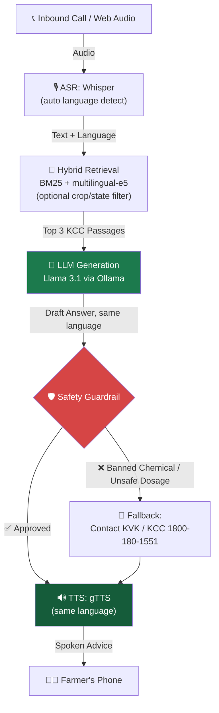

<div align="center">

# 🌾 KISANVANI <sub><sup>(કિસાનવાણી)</sup></sub>

### The Voice of the Farmer — powered by AI, grounded in reality.

**A voice-first, privacy-preserving agri-advisory system for every farmer, in every Indian language.**

Built for the **UNLEASHLLM Innovation Challenge** — *Agriculture & Rural Track* + *India-First Dataset Track*

<p>
  
  
  
  
  
</p>

<p>
  
  
  
  
</p>

</div>

---

## 📖 Table of Contents

- [The Vision](#-the-vision)
- [Key Features](#-key-features)
- [See It In Action](#-see-it-in-action)
- [Creative Engineering & Modern Web UI](#-creative-engineering--modern-web-ui)
- [How It Works (The Pipeline)](#️-how-it-works-the-pipeline)
- [Tech Stack](#️-tech-stack)
- [Run It Locally](#-run-it-locally)
- [Data Ingestion (Real KCC Data)](#-data-ingestion-real-kcc-data)
- [Project Structure](#-project-structure)
- [Design Blueprints](#-design-blueprints)
- [Evaluation](#-evaluation)
- [Known Limitations & Roadmap](#️-known-limitations--roadmap)

---

## 🚀 The Vision

In India, millions of farmers rely on basic feature phones and face severe language barriers when seeking agricultural advice. **KISANVANI** bridges this gap. It's an end-to-end voice-first system where a farmer dials an ordinary phone number, asks a question in their own spoken Indian language, and instantly receives a **grounded, safe, and accurate** voice response based on official Kisan Call Centre (KCC) data.

No app to install. No text to read. No language menu to navigate. Just a question, spoken naturally — and an answer, spoken back.

> **National by design.** KISANVANI isn't scoped to a single state or crop. The reference dataset spans **15 major crops** (cotton, rice, wheat, sugarcane, maize, soybean, groundnut, chilli, tomato, onion, potato, banana, mustard, gram, tea) across **13 states**, in **8 Indian languages**, sourced from the **AIKosh / data.gov.in KCC dataset** *(India-First Dataset Track)*. Coverage grows simply by ingesting more KCC data — zero code changes needed to add a new crop, state, or language.

---

## ✨ Key Features

| | Feature | What it means |
|---|---|---|
| 🗣️ | **Voice-in, voice-out** | Built for feature phones and non-literate users — speak the question, hear the answer. |
| 🇮🇳 | **National · multi-crop · multi-language** | Whisper auto-detects the spoken language; retrieval spans the full national KCC corpus, optionally narrowed by crop/state. |
| 📚 | **Grounded in reality** | Hybrid RAG (BM25 + dense embeddings) over real AIKosh/data.gov.in KCC transcripts — never invents an answer. |
| 🛡️ | **Safety-first guardrails** | A deterministic layer blocks banned chemicals (Monocrotophos, Endosulfan, …) and unsafe dosages, in every supported language/script. |
| 🔒 | **Privacy by design** | Caller IDs are SHA-256 hashed. Raw voice audio is deleted immediately after transcription — never retained. |
| 💸 | **Zero per-call cost** | Runs on a local open-source LLM (Llama 3.1 via Ollama) — no API metering, no data leaving the machine. |
| 🎨 | **Award-Winning Web UI** | Creative engineering showcasing Google Labs aesthetics, real-time eye tracking mascot, and Web Audio synthesizers. |

---

## 🎬 See It In Action

A farmer speaks a question in their own language — no app, no menu, no typing. Watch the full flow, and try the live demo yourself:

```bash
python telephony/webhook.py
# then open http://localhost:8000
```

The landing page includes a **live, working demo** — record a question in any supported language, and watch it move through transcription → retrieval → generation → safety guardrail → speech, in real time, with language auto-detected from your voice.

---

## 🎨 Creative Engineering & Modern Web UI

KISANVANI features an award-winning, high-impact web interface located at `telephony/fallback_ui/index.html`, engineered with Google Labs-inspired creative design:

- **Kinetic Preloader**: Real-time audio waveform canvas with dynamic multilingual typography showcasing Indian dialects.
- **Masked Pill Gallery Reveal**: GSAP ScrollTrigger and Lenis smooth scrolling orchestrating a staggered 4-row image reveal expanding through an SVG pill mask.
- **Interactive Pupil Mouse-Tracking Mascot**:
  - 2D vector pupil tracking using smooth linear damping (Lerp).
  - Inverse viewport geometry to accommodate CSS mirroring.
  - Sympathetic 3D perspective micro-tilt (`rotateX`/`rotateY`).
  - Organic autonomous blinking loops and squash-and-stretch click physics.
- **Floating Frosted Glass Header**: Borderless floating navigation bar with agricultural wheat sprout brand mark.
- **Monumental Geometric Aurora Footer**:
  - **Atmospheric Multi-Spectral Aurora**: 7 blended radial glow orbs pulsing with soft organic light.
  - **Kinetic Geometric Pillars**: 5 SVG shapes (Pink Squircle, Orange Hexagon, Green Pill, Golden Flower, Azure Circle) with independent floating sine-wave keyframes.
  - **Interactive 3D Magnetic Physics**: Cursor magnetic tilt and squash bounce on click.
  - **Web Audio API Pentatonic Harmonizer**: Generates real-time ambient chimes (C5, D5, E5, G5, A5) on shape interaction.
  - **Monumental Responsive Typography**: Edge-to-edge `clamp(3.2rem, 21vw, 21rem)` Google Labs scale lettering with zero letterform cutoffs.

---

## 🏗️ How It Works (The Pipeline)



Five open models, one phone call — nothing the farmer needs to do differently from talking to a person at the Kisan Call Centre.

---

## 🛠️ Tech Stack

| Layer | Technology | Why |
|---|---|---|
| **LLM (core)** | **Llama 3.1 (8B)** via **Ollama** (`localhost:11434`) | Open-source, satisfies the hackathon's LLM requirement; runs entirely on-device — no farmer data ever leaves the machine. |
| **ASR** | `openai/whisper-small` (HuggingFace `pipeline`) | Auto-detects the spoken language across all supported Indian languages. |
| **Retrieval** | `rank_bm25` (Okapi) + `sentence-transformers` (`intfloat/multilingual-e5-base`) | Hybrid lexical + semantic search, fused via min-max scaling, with optional crop/state pre-filtering. |
| **Safety** | Custom regex + table-matching against an approved Package-of-Practices (PoP) table | Deterministic — not left to the LLM's judgment. Covers Gujarati, Hindi, Punjabi, Bengali, Tamil, Telugu, Kannada, English. |
| **TTS** | Google TTS (`gTTS`) | Speaks back in the same language that was detected. |
| **Routing** | `FastAPI` | Serves the webhook, the fallback/demo UI, and a Twilio-ready call endpoint. |
| **Frontend** | Vanilla HTML5 · CSS3 · ES6+ · GSAP · Lenis · Web Audio API | Zero framework bloat, GPU-accelerated 60/120 FPS animations, Google Labs aesthetic. |
| **Data** | `data.gov.in` KCC (Kisan Call Centre) API | Real farmer queries and expert answers — see [Data Ingestion](#-data-ingestion-real-kcc-data). |

---

## 💻 Run It Locally

### 1. Clone & set up the environment

```bash
git clone https://github.com/akshitag001/KISANVANI.git
cd KISANVANI
python -m venv venv
source venv/bin/activate      # Windows: venv\Scripts\activate
pip install -r requirements.txt
```

### 2. Install & start Ollama (the core open-source LLM)

```bash
# Install from https://ollama.com/ (or: winget install Ollama.Ollama on Windows)
ollama serve            # starts the local Ollama API on :11434
ollama pull llama3.1    # pulls the 8B model (~4.9GB), one-time
```

### 3. Fetch KCC data & build the index

```bash
python ingest/fetch_kcc.py       # see below to use real data.gov.in data
python retrieval/build_index.py
```

### 4. Launch KISANVANI

```bash
python telephony/webhook.py
```

Open **`http://localhost:8000`** — record a question in any supported language, optionally narrow it by crop/state, and watch the full pipeline run live.

---

## 📡 Data Ingestion: Real KCC Data

[`ingest/fetch_kcc.py`](ingest/fetch_kcc.py) pulls farmer query/answer records from **data.gov.in's public KCC API**, covering all major crops and states rather than one district.

**To use live data instead of the built-in seed set:**

1. Register a free account at [data.gov.in/user/register](https://data.gov.in/user/register)
2. Generate an API key from **My Account → API Keys**
3. Set it as an environment variable:
   ```bash
   export DATA_GOV_IN_API_KEY="your-key-here"      # bash
   $env:DATA_GOV_IN_API_KEY = "your-key-here"       # PowerShell
   ```
4. Run `python ingest/fetch_kcc.py`

If no key is set (or the API is unreachable), the script **automatically falls back** to a hand-curated, KCC-realistic **national seed dataset** spanning multiple states, crops, and languages — so the rest of the pipeline is always runnable, zero setup required. Every record is tagged `"source": "data.gov.in"` or `"source": "seed"`, so it's always clear which data backs a given answer.

---

## 📂 Project Structure

```
KISANVANI/
├── orchestrator.py                 # Wires the full pipeline together end-to-end
├── MONUMENTAL_FOOTER_BLUEPRINT.md  # Standalone technical blueprint for Google Labs UI
├── ingest/
│   └── fetch_kcc.py                # Real data.gov.in ingestion + national seed fallback
├── asr/
│   └── transcribe.py               # Whisper ASR, auto language detection
├── retrieval/
│   ├── build_index.py              # Builds the hybrid BM25 + dense embedding index
│   └── retrieve.py                 # Hybrid search, optional crop/state filtering
├── generation/
│   ├── generate.py                 # Calls Llama 3.1 via Ollama
│   └── prompts.py                  # Language-parameterized, grounded RAG prompts
├── guardrail/
│   ├── check_answer.py             # Deterministic safety checks
│   └── pop_table.json              # Approved/banned chemicals & dosage limits (8 languages)
├── tts/
│   └── speak.py                    # gTTS speech synthesis, language-aware
├── telephony/
│   ├── webhook.py                  # FastAPI server (demo UI + Twilio-ready webhook)
│   └── fallback_ui/
│       ├── index.html              # Award-winning landing page & live interactive demo
│       ├── spotlight-mask-pill.svg # Vector mask for scroll reveal
│       └── videokisan.mp4          # Demo video asset
├── eval/
│   ├── run_eval.py                 # WER, Recall@3, guardrail effectiveness
│   └── gold_set.json               # Multi-language, multi-crop evaluation set
└── data/
    └── processed/
        └── kcc_national.json       # Ingested/seeded national KCC dataset
```

---

## 📐 Design Blueprints

The UI system includes a reusable technical blueprint for the Google Labs monumental footer design:

- **[MONUMENTAL_FOOTER_BLUEPRINT.md](MONUMENTAL_FOOTER_BLUEPRINT.md)**: Includes complete standalone HTML, CSS tokens, SVG shapes, Web Audio API synthesizer, and responsive typography clamp calibrations for any future product.

---

## 🧪 Evaluation

[`eval/run_eval.py`](eval/run_eval.py) measures, across the multi-language/multi-crop gold set in [`eval/gold_set.json`](eval/gold_set.json):

- **ASR Word Error Rate (WER)** and language-detection accuracy
- **Retrieval Recall@3** (with the same optional crop/state narrowing used in production)
- **Guardrail effectiveness** — tested via adversarial queries, e.g. asking about banned chemicals across multiple languages

---

## ⚠️ Known Limitations & Roadmap

- **Guardrail coverage** — chemical/dosage safety terms are curated for 8 languages so far. Adding a new language to ASR/TTS doesn't automatically make the guardrail safe in that language; [`guardrail/pop_table.json`](guardrail/pop_table.json) must be manually extended and verified first.
- **No live telephony integration yet** — `/twilio_webhook` in [`telephony/webhook.py`](telephony/webhook.py) is a placeholder; a production deployment needs real Twilio (or similar) call recording + TwiML responses wired in.
- **Eval audio fixtures** — not yet recorded/synthesized (see [Evaluation](#-evaluation)).

---

<div align="center">

*Built with ❤️ for the farmers of India.*

**[⬆ back to top](#-kisanvani-)**

</div>